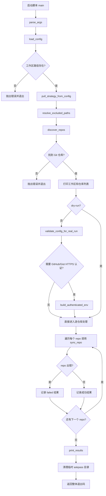
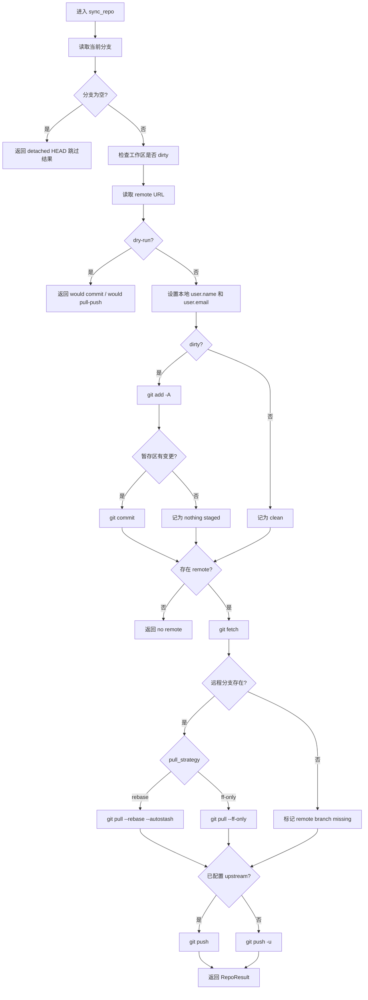

# Workspace Git Sync

`workspace-git-sync` 是一个可随文件夹一起迁移的本地 skill，用来统一提交、拉取并推送某个工作区下的全部 Git 仓库。它不依赖 PowerShell 脚本，核心逻辑在 [scripts/sync_workspace_git.py](scripts/sync_workspace_git.py)。

把整个 `workspace-git-sync` 文件夹复制到另一个工作区根目录后，脚本默认会把“skill 文件夹的上一级目录”当作新的工作区根目录，因此可以开箱即用。

## 目录结构

```text
workspace-git-sync/
├─ agents/
│  └─ openai.yaml
├─ scripts/
│  └─ sync_workspace_git.py
├─ README.md
├─ SKILL.md
└─ workspace-sync.config.json
```

## 快速使用

1. 编辑 [workspace-sync.config.json](workspace-sync.config.json)。
2. 填写 `git_user_name`、`git_user_email`、`github_username`。
3. 二选一提供令牌：
   `github_pat`
   `github_pat_env` 指向的环境变量，例如 `GITHUB_TOKEN`
4. 先执行预演：

```bash
python scripts/sync_workspace_git.py --dry-run
```

5. 确认无误后正式执行：

```bash
python scripts/sync_workspace_git.py
```

## 配置说明

[workspace-sync.config.json](workspace-sync.config.json) 当前字段含义如下：

- `git_user_name`: 写入每个仓库本地 Git 配置的提交用户名。
- `git_user_email`: 写入每个仓库本地 Git 配置的提交邮箱。
- `github_username`: 访问 GitHub 或 Gist HTTPS 远程仓库时使用的用户名。
- `github_pat`: 可直接填写的 GitHub Personal Access Token。
- `github_pat_env`: 优先读取的环境变量名；如果该环境变量存在，则优先于 `github_pat`。
- `remote_name`: 默认同步的远程名，通常为 `origin`。
- `default_commit_message`: 用户未显式传入 `--commit-message` 时使用的提交信息。
- `pull_strategy`: 支持 `rebase` 或 `ff-only`。
- `exclude_paths`: 可选排除目录列表。相对路径按工作区根目录解析，也支持绝对路径。

## 命令示例

默认扫描 skill 上一级目录：

```bash
python scripts/sync_workspace_git.py
```

只做预演，不修改任何仓库：

```bash
python scripts/sync_workspace_git.py --dry-run
```

指定提交信息：

```bash
python scripts/sync_workspace_git.py --commit-message "chore: sync workspace changes"
```

如果 skill 不放在工作区根目录下，可以显式指定：

```bash
python scripts/sync_workspace_git.py --workspace-root "C:/path/to/workspace"
```

## 执行逻辑

脚本主要分成 4 个阶段：

1. 解析参数并加载配置。
2. 解析排除目录，扫描真实 Git 工作树仓库。
3. 非 `--dry-run` 时校验身份配置，并为 GitHub/Gist HTTPS 远程仓库构造临时 `GIT_ASKPASS` 环境。
4. 逐仓库执行提交、拉取、推送，并汇总结果。

## 代码流程图



## 单仓库处理流程

`sync_repo()` 的主要决策如下：



## 关键实现点

- 只把真正能通过 `git rev-parse --is-inside-work-tree` 的目录视为仓库，避免把异常目录误识别为仓库。
- 自动跳过 skill 自身目录，避免把 `workspace-git-sync` 当作被同步对象。
- 只有在远程 URL 是 `https://github.com/...` 或 `https://gist.github.com/...` 时，才会启用临时认证环境。
- 临时认证通过 `GIT_ASKPASS` 注入，不会把令牌直接写进仓库配置。
- 即使某个仓库失败，脚本也会继续处理后续仓库，最后统一汇总结果。

## 建议使用方式

- 第一次接入新工作区时先跑一次 `--dry-run`。
- 优先使用环境变量保存令牌，而不是明文写入 `github_pat`。
- 如果工作区里有缓存目录、镜像目录或其他不应参与同步的路径，就放进 `exclude_paths`。
- 批量同步前尽量确认每个仓库当前分支都在预期状态，避免把不该提交的改动一起提交。
